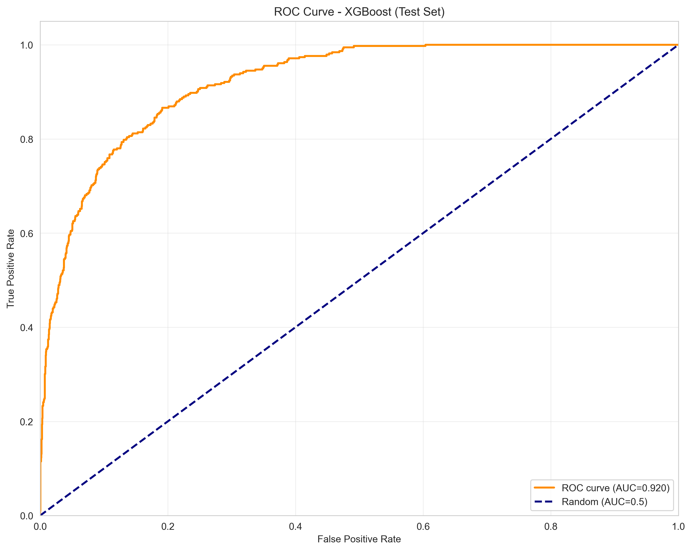
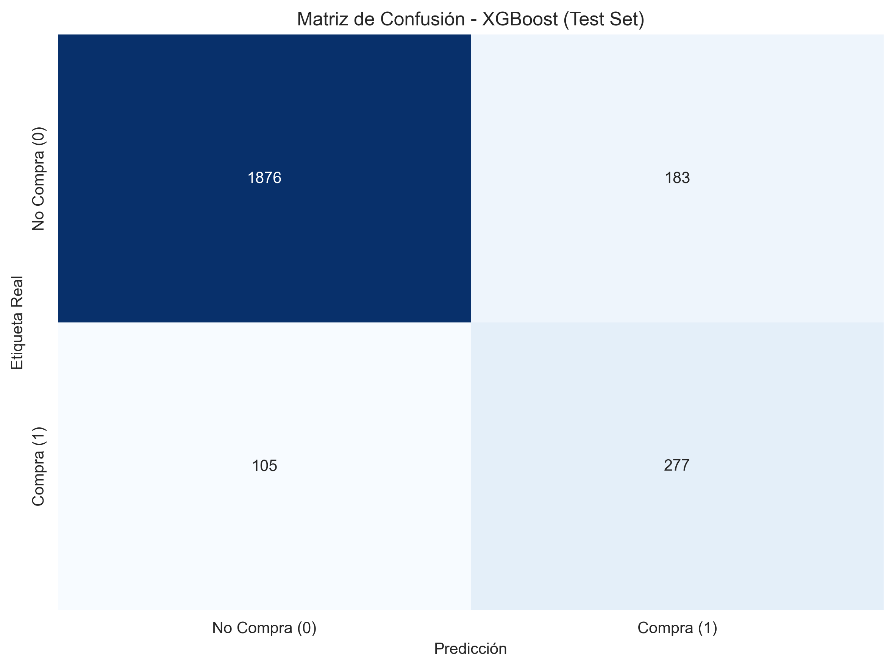
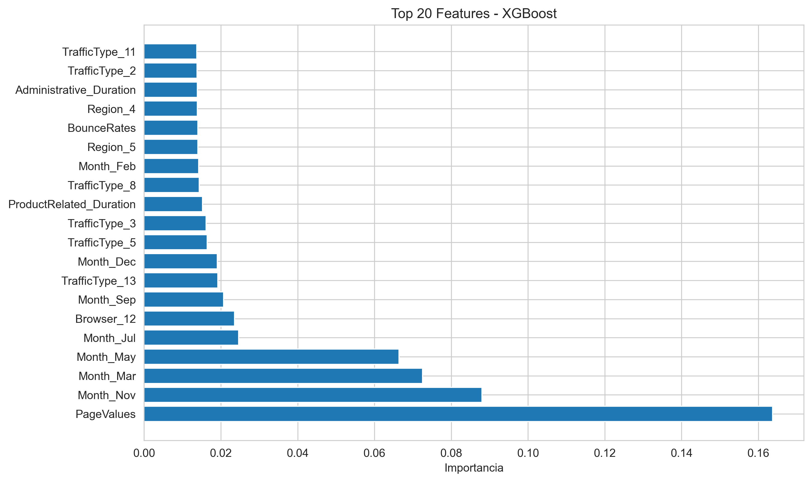
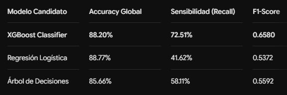

# 🛍️ Sistema IA Predictivo: Intención de Compra E-commerce en Tiempo Real

[](https://www.python.org/)
[](https://streamlit.io/)
[](https://xgboost.readthedocs.io/)
[](https://upateco.edu.ar/)

Este repositorio contiene la solución de Inteligencia Artificial desarrollada para estimar en tiempo real la probabilidad de conversión de un usuario en un sitio de comercio electrónico. El núcleo predictivo clasifica si la sesión actual del visitante culminará en una transacción comercial exitosa (`Revenue = 1`) o en abandono de la plataforma (`Revenue = 0`).


## 🏛️ Información Institucional
* **Institución:** Universidad Provincial de Administración Tecnológica (UPATecO)
* **Carrera:** Tecnicatura Universitaria en Ciencia de Datos e IA Aplicada
* **Materia:** Modelado de Sistemas de IA Aplicada
* **Docente:** Lic. Walter Gabriel Ramírez
* **Equipo de Desarrollo (Grupo 13):**
  * Añazgo, Pedro David
  * Cardozo Vera, José Alberto
  * Correjidor, Walter
  * Testa, Maximiliano Javier
  
## Descripcion breve del problema y objetivo
En e-commerce, no siempre se puede identificar en tiempo real que sesiones tienen alta probabilidad de conversion. Esto dificulta activar acciones comerciales oportunas (ofertas, retargeting, mensajes personalizados).

El objetivo del proyecto es entrenar y seleccionar un modelo de clasificacion binaria que estime la probabilidad de compra por sesion para apoyar decisiones de negocio proactivas.

## Resumen del EDA
Hallazgos principales obtenidos en `notebooks/exploratory/eda.ipynb`:

- Dataset con 18 atributos (10 numericos y 8 categoricos), sin valores faltantes y con registros duplicados detectados.
- Variable objetivo desbalanceada: ~85% No Compra y ~15% Compra.
- Variables numericas con sesgo positivo fuerte y outliers, especialmente en duraciones y `PageValues`.
- `PageValues` aparece como predictor clave de conversion.
- `BounceRates` y `ExitRates` se asocian negativamente con compra y muestran alta correlacion entre si.
- Se observa estacionalidad: noviembre presenta el mayor nivel de conversion.
- Resultado interesante: `New_Visitor` convierte mas que `Returning_Visitor` en este dataset.

## Resumen del modelado
El modelado se desarrollo en `notebooks/modeling/modelado.ipynb` comparando Logistic Regression, Decision Tree y XGBoost.

Configuracion general:

- Split train/test 80/20 estratificado.
- Validacion cruzada `StratifiedKFold` de 5 folds.
- Preprocesamiento con `ColumnTransformer`:
    - `StandardScaler` para variables numericas.
    - `OneHotEncoder` para categoricas.

Modelo ganador: XGBoost

Metricas en test set:

- Accuracy: 0.8820
- Precision: 0.6022
- Recall: 0.7251
- F1-Score: 0.6580
- ROC-AUC: 0.9205

Comparacion ROC/AUC de modelos (test set):


Comparativa AUC:

| Modelo | ROC-AUC |
|---|---:|
| XGBoost | 0.9205 |
| Logistic Regression | 0.8997 |
| Decision Tree | 0.7444 |



#### Matriz de Confusión e Importancia de Características
El modelo logra clasificar de forma correcta 277 transacciones comerciales del conjunto de prueba. Asimismo, el gráfico de relevancia confirma que el comportamiento dinámico del usuario a través de `PageValues` domina el peso predictivo del sistema.




## 📂 Arquitectura de Directorios y Archivos
El repositorio está estructurado modularmente para garantizar la reproducibilidad y el orden de los artefactos predictivos, analíticos y de interfaz:

```text
📦 proyecto-modelado-ia**
├── 📁 .venv                              # Entorno virtual local 
├── 📁 apps                               # Capa de visualización y lógica de inferencia
│   ├── 📁 __pycache__
│   ├── 📄 README.md                      # Instrucciones específicas de la UI
│   ├── 🐍 streamlit_app.py               # Aplicación interactiva de Streamlit (Con Bloque 3)
│   └── 🐍 utils.py                       # Helpers analíticos y carga de artefactos
├── 📁 data                               # Gestión de Datasets del proyecto
│   ├── 📁 processed                      # Particiones procesadas (X_train, y_train, etc.)
│   └── 📁 raw                            # Datos sin procesar
│       └── 📊 online_shoppers_intention.csv # Dataset histórico de navegación web
├── 📁 docs                               # Documentación y reportes de procesos
│   └── 📄 preprocessing_report.txt       # Reporte generado de ingeniería de variables
├── 📁 models                             # Artefactos analíticos entrenados y gráficos
│   ├── 🖼️ confusion_matrix_xgboost.png  # Gráfico: Matriz de confusión final
│   ├── 🖼️ feature_importance_xgboost.png # Gráfico: Importancia de características
│   ├── 📦 modelo_ganador.pkl             # Clasificador XGBoost serializado (.pkl)
│   ├── 📦 preprocessor.pkl               # Pipeline de transformación (Scaler + OHE)
│   ├── 📄 resumen_modelo_ganador.txt     # Métricas técnicas de validación consolidadas
│   ├── 🖼️ roc_curve_xgboost.png          # Gráfico: Curva ROC del modelo optimizado
│   └── 🖼️ roc_curves_comparacion.png      # Gráfico: Comparativa AUC-ROC multimodelo
├── 📁 notebooks                          # Laboratorios analíticos (Jupyter Notebooks)
│   ├── 📁 exploratory                    # Jupyter Notebook: Análisis Exploratorio (EDA)
│   └── 📁 modeling                       # Jupyter Notebook: Entrenamiento y Tuning
├── ⚙️ .gitignore                          # Exclusiones de Git (archivos temporales y entornos)
├── 📄 README.md                          # Guía principal del repositorio (Este archivo)
└── 📋 requirements.txt                   # Listado completo de dependencias del entorno 
```

 
## 📊Resumen Ejecutivo del Pipeline
**🔍 Fase 1: Hallazgos de Análisis Exploratorio (EDA)** 
* **Desbalance Extremo:** Se identificó que solo el 15.4% de las sesiones históricas generan compras efectivas, lo que requirió el uso de métricas inmunes al desbalance para evaluar la calidad (ROC-AUC y Recall).
* **Correlaciones de Peso:** La característica PageValues (el valor promedio asignado a las páginas visitadas por el usuario) demostró ser el predictor más potente para estimar el éxito de la conversión.
* **Indicadores de Fuga:** Altos niveles de BounceRates y ExitRates marcan una frontera clara hacia el abandono temprano del carrito de compras.

**🤖 Fase 2: Modelado y Resultados de Performance**
Se evaluaron tres arquitecturas bajo un esquema riguroso de Validación Cruzada Estratificada (*StratifiedKFold* con **k=5**). El algoritmo XGBoost Classifier se seleccionó como el núcleo predictivo debido a su sobresaliente capacidad para maximizar el área bajo la curva controlando el desbalance de clases de forma nativa.

## 📊 Matriz Comparativa de Performance de Modelos Candidatos

Para validar la robustez de la solución, se evaluaron múltiples algoritmos bajo un esquema estricto de validación cruzada estratificada. A continuación, se presenta la matriz completa con las métricas técnicas obtenidas en el conjunto de prueba independiente, donde se evidencia el rendimiento superior de nuestro modelo final:



## 💡 Impacto de Negocio: 
Aunque la Regresión Logística arroja un Accuracy sutilmente mayor, su Recall es sumamente deficiente (41.62%). Elegir XGBoost nos permite capturar de manera temprana al 72.51% de los clientes con intenciones de compra legítimas para aplicar automatizaciones de marketing.

## 📋 Consciencia de Límites (Escenarios de Falla del Sistema)
En concordancia con los criterios de evaluación de la cátedra, se identifican las siguientes fronteras operativas del modelo:

1. **Comportamiento Automatizado (Bots):** Sesiones de web scraping o rastreadores que visitan decenas de páginas de productos en milisegundos pueden alterar artificialmente las variables de duración y tasas de rebote, provocando falsos positivos en la predicción.

2. **Deriva de Datos Comerciales (Data Drift):** Cambios estructurales en el diseño de la interfaz del e-commerce o campañas masivas imprevistas de marketing pueden modificar los promedios de PageValues históricos, requiriendo un reentrenamiento del estimador XGBoost para recuperar la precisión adaptativa.

## 🔮 Roadmap Futuro (Sistemas Híbridos - Bloque 3)
En línea con las últimas unidades de la cátedra sobre optimización de datos complejos, la aplicación integra y detalla la evolución de la solución hacia una arquitectura híbrida de GenAI:

* **Síntesis Tabular Avanzada:** Justificación de la incorporación de SDV (Synthetic Data Vault) para poblar simulaciones comerciales sin exponer datos de comportamiento de usuarios reales ni incurrir en sobreajuste estadístico.

* **Agente Conversacional con RAG / Tool Calling:** Integración del backend analítico con un LLM corporativo (mediante LangChain y APIs). Esto permitirá a la gerencia de marketing interrogar al sistema mediante lenguaje natural ("Qué usuarios en Noviembre corren riesgo de abandonar el carrito?") e instruir a la IA a disparar cupones de descuento automáticos mediante la ejecución de funciones específicas mapeadas directamente sobre nuestro clasificador XGBoost.

## 🚀 Guía de Instalación y Ejecución Detallada
Siga estrictamente los siguientes pasos en su terminal local para inicializar el entorno virtual controlado e implementar el despliegue del sistema interactivo:
**Como ejecutar la demo:**
La demo esta implementada con Streamlit en `apps/streamlit_app.py`.

## 1. Clonar el repositorio y posicionarse en la raíz:
**git clone [https://github.com/tu-usuario/tu-repositorio.git](https://github.com/tu-usuario/tu-repositorio.git)**
**cd tu-repositorio**

## 2. Inicializar y activar el entorno virtual reproducible (.venv):
En sistemas Windows (PowerShell):
  **python -m venv .venv**
  **.\.venv\Scripts\Activate.ps1**

## 3. Instalar dependencias:

Powershell:
  **python -m pip install -r requirements.txt**

## 4. Ejecutar la app:

Powershell:  
  **streamlit run apps/streamlit_app.py**

**Notas:**
- La consola generará la dirección local **http://localhost:8501**, la cual abrirá automáticamente en su navegador web las tres capas funcionales del tablero: el simulador interactivo de conversión, el monitor offline de métricas de calidad y la propuesta de extensión del Bloque 3
- Asegurate de tener `models/modelo_ganador.pkl` (y opcionalmente `models/preprocessor.pkl`) en la carpeta `models/`.
- El modelo y los artefactos generados en el entrenamiento se guardan en `models/`.

